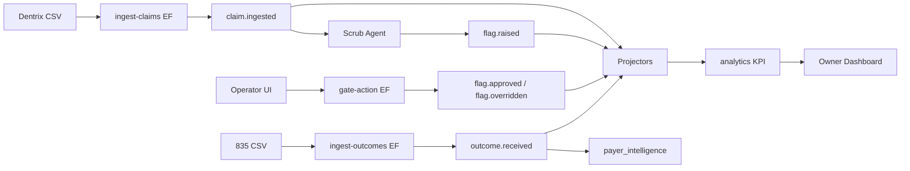

# Backstop platform architecture

**Product:** All-in-one insurance billing for dental clinics — sits on the PMS (Dentrix first), replaces three vendor lanes over time (submission/attachments, AR/denials, conversational analytics).

**Durable asset:** Proprietary **CDT × payer × outcome** graph (`payer_intelligence`).

---

## Six layers (north star)

```
┌─────────────────────────────────────────────────────────────────┐
│ L1 SURFACES                                                     │
│   Operator Workspace · Biller Console* · Owner Dashboard ·      │
│   Patient Pay* · Jarvis*                                        │
├─────────────────────────────────────────────────────────────────┤
│ L2 ORCHESTRATION                                                │
│   Governance Gate · Worklist engine · Agent fleet               │
├─────────────────────────────────────────────────────────────────┤
│ L3 DOMAIN SERVICES                                              │
│   claims · eligibility · attachments · coding · denials/appeals │
│   AR · payments                                                 │
├─────────────────────────────────────────────────────────────────┤
│ L4 INTEGRATION                                                  │
│   Dentrix sync · clearinghouse · payment processor · 835 ingest │
├─────────────────────────────────────────────────────────────────┤
│ L5 DATA PLATFORM                                                │
│   Event log · Payer Intelligence · Analytics/KPI engine         │
├─────────────────────────────────────────────────────────────────┤
│ L6 FOUNDATION                                                   │
│   Multi-tenant · Auth/RBAC · RLS · Jobs · Observability · Config│
└─────────────────────────────────────────────────────────────────┘
* not in Phase 1 slice
```

Phase 1 pierces **every layer once** with synthetic data — not full layer depth.

---

## Architecture principles (non-negotiable)

### 1. Event-sourced audit trail (CQRS-lite)

- **Append-only `events` table** is the audit trail and learning source.  
- **Never UPDATE** domain state in place for outcomes, overrides, or fixes.  
- **Projectors** build read models (`claims_current`, `flags_open`, KPI snapshots).  
- Agents and UI **emit events**; they do not mutate rows directly (except projectors).

### 2. Multi-tenant from line one

- Every row scoped by `tenant_id` (+ `clinic_id` where relevant).  
- Supabase **RLS** enforces isolation.  
- No `service_role` key in browser code.

### 3. Adapter pattern (L4)

All external systems behind interfaces:

```typescript
interface IngestAdapter {
  parse(source: Buffer | string): Promise<CanonicalClaim[]>;
}
```

Phase 1: **CSV Dentrix export** only. Dentrix API, clearinghouse, payments = later.

### 4. Agents emit events

Scrub agent flow:

```
load claim (tool) → rules → optional LLM → emit flag.raised (tool)
```

No direct `INSERT INTO flags` from agent code.

### 5. Insight → action

Dashboard KPIs drill to claims and events. Jarvis (later) uses same data plane as analytics.

### 6. Payer intelligence moat

`outcome.received` events **upsert** `(tenant, payer, cdt_code)` stats. Scrub agent **reads** before flagging.

---

## Stack (locked)

| Layer | Technology |
|-------|------------|
| Monorepo | Turborepo, pnpm workspaces |
| Language | TypeScript `strict` everywhere |
| Frontend | React (Vite) + Tailwind + shadcn/ui — **SPA, not Next.js** |
| API | Supabase Edge Functions (Deno/TS) for app/API |
| Workers | AWS Lambda/Fargate for heavy agent jobs, EDI (Phase 2+) |
| DB / Auth | Supabase Postgres, Auth, Storage |
| AI | Anthropic — Sonnet (judgment), Haiku (extraction) |
| Frontend host | S3 + CloudFront |
| Email | Resend (later) |

**Phase 1 simplification:** Run scrub + API on Edge Functions until volume requires Fargate split.

---

## Target monorepo layout

```
/apps
  /operator          # Gate UI — upload, flags, approve/override
  /owner             # KPI tile + drill-down (Jarvis later)
/packages
  /ui                # Shared shadcn components
  /core              # Canonical claim model, domain types
  /events            # Emit, replay, projectors
  /agents            # Scrub orchestrator + rules + LLM
  /tools             # Agent function-calling tools
  /analytics         # KPI engine
  /intelligence      # payer_intelligence read/write
  /auth              # Tenant context, RBAC
  /db                # Types, migration helpers
  /integrations      # Ingest adapters (CSV only in P1)
  /edi               # STUB — 835/837 interfaces
/supabase
  /migrations
  /functions         # Edge Functions
/scripts
  seed-synthetic.ts
```

See [PACKAGE_MAP.md](./PACKAGE_MAP.md) for dependencies and ownership.

---

## Domain vocabulary

Use everywhere (DB, API, UI, events):

`tenant`, `clinic`, `claim`, `claim_line`, `cdt_code`, `payer`, `flag`, `override`, `fix`, `outcome`, `event`, `payer_intelligence`

**Dental:** CDT (`D####`) and 837D — **never** CPT or ICD-10 in dental paths.

---

## Security & PHI

- Synthetic data only in repo until HIPAA BAAs signed.  
- No secrets in git.  
- Overrides require `reason` text (audit).  

---

## Legacy prototype

The existing Next.js app (`src/`) is a **spike**. Port:

- `src/lib/rules/*` → `packages/agents`  
- `src/lib/csv/*` → `packages/integrations`  
- UI patterns → `packages/ui`, `apps/operator`

See [LEGACY_REFERENCE.md](./LEGACY_REFERENCE.md).

---

## Diagram: Phase 1 data flow


