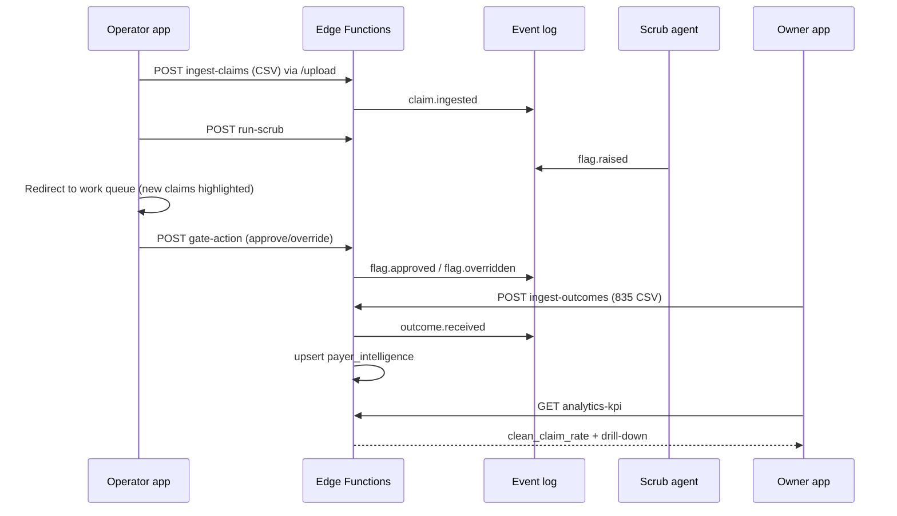

# Phase 1 medium build — what it looks like

**Audience:** Bungaroo, US team, stakeholders  
**Fidelity:** Medium — screen layout, components, APIs, sample data. Not pixel-perfect Figma.  
**UX source of truth:** [USER_FLOWS.md](./USER_FLOWS.md) (competitive research + locked interaction rules)  
**Updates:** When UI or flows change, update this file + [USER_FLOWS.md](./USER_FLOWS.md) + [STATUS.md](../STATUS.md). See [DOC_MAINTENANCE.md](../DOC_MAINTENANCE.md).

**Visual preview:** Open [backstop-phase1-build.canvas.tsx](/Users/ameerabouhouli/.cursor/projects/Users-ameerabouhouli-ameershairyballs-ameershairyballs/canvases/backstop-phase1-build.canvas.tsx) beside chat.

---

## System at a glance

```
┌─────────────────────────────────────────────────────────────────────────┐
│                         BACKSTOP PHASE 1                                │
├──────────────────────────────┬──────────────────────────────────────────┤
│   apps/operator              │   apps/owner                             │
│   • Work queue (default)     │   • Clean-claim rate KPI (single metric) │
│   • Claim action view        │   • Drill-down table                     │
│   • Upload CSV (secondary)   │   • Outcomes upload                      │
├──────────────────────────────┴──────────────────────────────────────────┤
│   Supabase Edge Functions: ingest-claims · run-scrub · gate-action ·    │
│   ingest-outcomes · analytics-kpi                                       │
├─────────────────────────────────────────────────────────────────────────┤
│   packages: events · agents · analytics · intelligence · integrations   │
├─────────────────────────────────────────────────────────────────────────┤
│   Postgres: events (append-only) · read models · payer_intelligence       │
└─────────────────────────────────────────────────────────────────────────┘
```

---

## Information architecture

### Operator (`apps/operator`)

| Route | Screen | Default? |
|-------|--------|----------|
| `/` | Work queue | **Yes** — landing after login |
| `/claims/:id` | Claim action view | Open from queue row |
| `/upload` | CSV ingest | Header action only |
| `/outcomes/upload` | 835 ingest | Optional P1 |

**Nav:** Top bar — `Work queue` · `Upload` · clinic selector · sign out. No Vyne-style module sidebar.

### Owner (`apps/owner`)

| Route | Screen |
|-------|--------|
| `/` | KPI dashboard |
| `/claims` | Drill-down list |
| `/claims/:id` | Summary + link to operator (optional P1) |

---

## User roles (Phase 1)

| Role | App | Primary job |
|------|-----|-------------|
| `operator` | Operator | Clear flags on today's queue; upload batch CSV when needed |
| `owner` | Owner | See clean-claim rate; upload ERA outcomes |

Same person may use both apps at a small clinic.

---

## End-to-end flow (happy path)



---

## App 1: Operator (`apps/operator`)

**URL (dev):** `http://localhost:5173`  
**Auth:** Supabase login → JWT with `tenant_id`, role `operator`

### Screen O1 — Work queue (default home)

Wireframe and density rules: [USER_FLOWS.md § Work queue](./USER_FLOWS.md#work-queue-wireframe).

```
┌──────────────────────────────────────────────────────────────┐
│ Backstop Operator          [Upload CSV]     user · clinic ▼  │
├──────────────────────────────────────────────────────────────┤
│ Work queue · 12 open flags across 8 claims                   │
│ [Severity ▼] [Payer ▼] [AR age ▼]  🔍 Search patient/payer  │
├──────────────────────────────────────────────────────────────┤
│ ● CRITICAL  Smith · Delta · 06/12  $890  Attachment·SRP    │
│ ● HIGH      Jones · MetLife · 06/15  $143  Provider addr   │
│ ○ MEDIUM    Lee · MetLife · 06/18  $220  Frequency D1110   │
│ ...                                                          │
└──────────────────────────────────────────────────────────────┘
```

| Element | Component (`@backstop/ui`) | API / data |
|---------|---------------------------|------------|
| Queue table | `DataTable` (compact rows) | `claims_current` + `flags_open` aggregated |
| Filters | `Select`, search input | Client filter on read model |
| Upload CTA | `Button` → `/upload` | — |
| Row click | — | Navigate `/claims/:id` |

**Density:** ≥10 rows visible at 1080p. Compact table rows — not InsideDesk card rows.

---

### Screen O2 — Claim action view

Wireframe: [USER_FLOWS.md § Claim action view](./USER_FLOWS.md#claim-action-view-wireframe).

```
┌──────────────────────────────────────────────────────────────┐
│ ← Back    Patient · Payer · DOS · $143    [2 flags open]     │
├──────────────────────────────────────────────────────────────┤
│ ⚠ PRIMARY: Provider address rejected by payer                │
│    "Entity's Street Address" — fix billing provider zip       │
├──────────────────────────────────────────────────────────────┤
│ FLAG CARDS (critical → high → medium)                        │
│ ┌──────────────────────────────────────────────────────────┐ │
│ │ CRITICAL · missing_attachment · D4341 line 1             │ │
│ │ SRP requires perio chart + radiograph                    │ │
│ │ [Approve]  [Override…]                                   │ │
│ └──────────────────────────────────────────────────────────┘ │
├──────────────────────────────────────────────────────────────┤
│ Claim summary (collapsed)                    [Expand ▼]      │
│ Event timeline (audit)                       [Expand ▼]      │
└──────────────────────────────────────────────────────────────┘
```

**Override modal (required):**

```
┌─────────────────────────────────────┐
│  Override flag                      │
│  Reason (required)                  │
│  ┌─────────────────────────────────┐│
│  │ Attachment sent via portal…     ││
│  └─────────────────────────────────┘│
│           [Cancel]  [Confirm]       │
└─────────────────────────────────────┘
```

| Action | API | Event |
|--------|-----|-------|
| Approve | `POST /gate-action` `{ action: "approve" }` | `flag.approved` |
| Override | `POST /gate-action` `{ action: "override", reason }` | `flag.overridden` |

Reject override if `reason` is empty (UI + API).

**Anti-patterns:** No Patient / Provider / Procedures tabs. Context inline on flag cards.

---

### Screen O3 — Upload (secondary)

```
┌──────────────────────────────────────────────────────────────┐
│ ← Work queue                                                 │
├──────────────────────────────────────────────────────────────┤
│  Drop Dentrix export CSV or [Browse]                         │
│  [ Upload & run scrub ]                                      │
│  Parse summary: N claims, M lines, errors                  │
└──────────────────────────────────────────────────────────────┘
```

After success → redirect to work queue with new claims highlighted.

| Element | API |
|---------|-----|
| CSV upload | `POST /ingest-claims` then `POST /run-scrub` |

---

### Operator component tree

```
App
├── AuthProvider (@backstop/auth)
├── Layout (top nav, clinic selector)
├── pages/
│   ├── WorkQueuePage (/)          ← default route
│   │   ├── QueueFilters
│   │   └── ClaimQueueTable
│   ├── ClaimActionPage (/claims/:id)
│   │   ├── PrimaryBlockerBanner
│   │   ├── FlagList
│   │   │   └── FlagCard (severity, reason, inline context, actions)
│   │   ├── ClaimSummaryCollapsible
│   │   └── EventTimelineCollapsible
│   └── UploadPage (/upload)
│       ├── CsvUpload → ingest + scrub → redirect queue
│       └── ParseSummary
```

---

## App 2: Owner (`apps/owner`)

**URL (dev):** `http://localhost:5174`  
**Auth:** role `owner` or `admin`

### Screen W1 — Dashboard (single KPI)

Wireframe: [USER_FLOWS.md § Owner dashboard](./USER_FLOWS.md#owner-dashboard-wireframe).

```
┌──────────────────────────────────────────────────────────────┐
│ Backstop Owner                              [Sign out]       │
├──────────────────────────────────────────────────────────────┤
│ Clean-claim rate                    Last 30 days ▼           │
│              67%                                             │
│         ████████████░░░                                      │
│ 3 claims ingested · 2 passed gate · 1 with open flags        │
├──────────────────────────────────────────────────────────────┤
│ Claims below target                          [Export]        │
│ claim_id    patient   payer      flags   last_event          │
│ SYN-CLM-002 MetLife   3          flag.raised                 │
│ ...                                                          │
│ Upload payer outcomes (835)                                  │
│ [ Browse ]  [ Record outcomes ]                              │
└──────────────────────────────────────────────────────────────┘
```

**Phase 1:** One KPI tile only. No secondary stat cards ($ flagged is P1.5).

| Element | API |
|---------|-----|
| KPI | `GET /analytics-kpi?metric=clean_claim_rate` |
| Drill-down | Same response `drill_down[]` |
| Outcomes upload | `POST /ingest-outcomes` |

---

### Screen W2 — Claim drill-down (optional P1)

Click row → `/claims/:id` event timeline:

```
claim.ingested          2026-06-26 10:00
flag.raised (x5)        2026-06-26 10:01
flag.approved (x2)      2026-06-26 10:15
flag.overridden (x1)    2026-06-26 10:16  "Attachment via portal"
outcome.received        2026-06-26 14:00  denied CO-97
```

---

### Owner component tree

```
App
├── AuthProvider
├── Layout
├── pages/
│   ├── DashboardPage (/)
│   │   ├── KpiTile (clean-claim rate only)
│   │   ├── DrillDownTable
│   │   └── OutcomesUpload
│   └── ClaimEventsPage (optional)
│       └── EventTimeline
```

---

## Shared design (`packages/ui`)

| Token / component | Use |
|-------------------|-----|
| Severity pills | `low` gray, `medium` amber, `high` orange, `critical` red |
| `FlagCard` | Port from legacy `claim-flags.tsx` — primary pattern |
| `KpiTile` | Large number + period selector |
| Mobile-first | Stack on `<768px`; ≥44px touch targets on Approve/Override |

Colors: shadcn neutral theme (match legacy prototype).

---

## Sample data (synthetic)

| File | Feeds |
|------|-------|
| `data/synthetic/sample-claims.csv` | 3 claims — SRP, crown, buildup flags |
| `data/synthetic/sample-outcomes.csv` | paid / denied / downcoded |

Expected KPI on full demo: **67%** clean (2 of 3 claims with zero high/critical open flags at gate).

See [research/DENTRIX_EXPORT_FORMAT.md](../research/DENTRIX_EXPORT_FORMAT.md) for column mapping.

---

## Legacy vs target mapping

| Legacy (`src/`) | Target |
|-----------------|--------|
| `/` upload + flags on same page | Operator O1 queue + O2 action view; O3 upload |
| `/dashboard` | Owner W1 |
| In-memory store | `events` + projectors |
| `POST /api/ingest` | `ingest-claims` + `run-scrub` EF |
| Client-side flag dismiss | `gate-action` → events |

---

## Phase 1.5 (document only)

| Feature | Screen |
|---------|--------|
| Jarvis chat | Owner side panel |
| Full event timeline | Operator + Owner |
| Tenant blocker banner | Operator header |
| Biller Console | Separate app — Phase 2+ |

---

## Acceptance (medium build)

Aligned with [USER_FLOWS.md § Acceptance criteria](./USER_FLOWS.md#acceptance-criteria-additions-ws-06--ws-08):

- [ ] Default route `/` is work queue, not upload
- [ ] Queue shows ≥10 rows at 1080p
- [ ] Claim detail shows all open flags without tabs
- [ ] Highest-severity flag in page header
- [ ] Override requires reason (UI + API)
- [ ] After CSV upload, user lands on queue
- [ ] Owner dashboard: single KPI + drill-down only
- [ ] Mobile: usable on phone width
- [ ] This doc + canvas updated if layouts change
